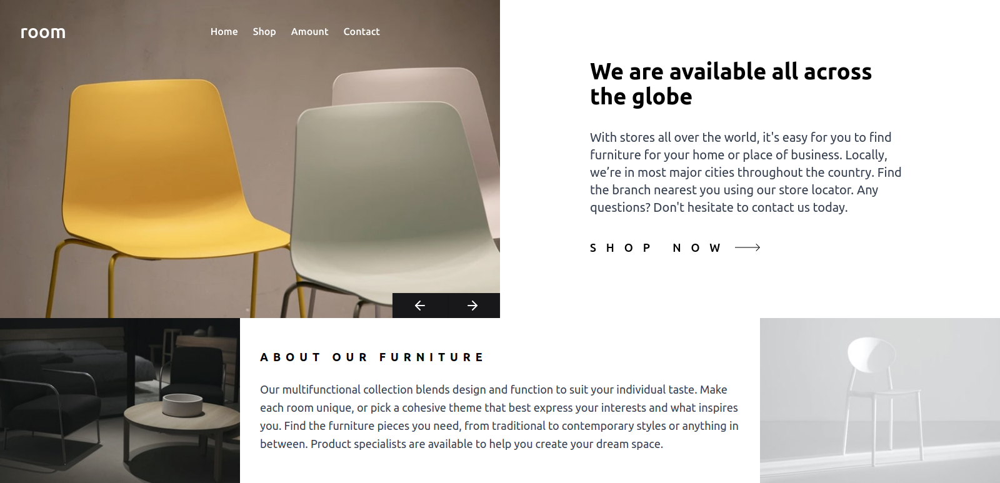
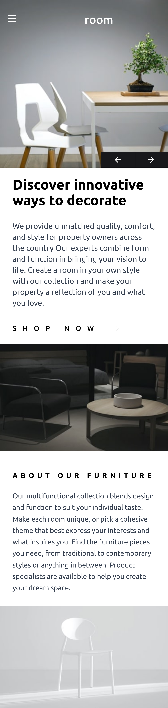

# Frontend Mentor - Room homepage

-   Live Site URL: [live site URL](https://frontend-mentor-room-homepage-sigma.vercel.app/)

This is a solution to the [Room homepage challenge on Frontend Mentor](https://www.frontendmentor.io/challenges/room-homepage-BtdBY_ENq).

## Table of contents

-   [Overview](#overview)
    -   [Features](#Features)
    -   [Screenshot](#screenshot)
-   [My process](#my-process)
    -   [Built with](#built-with)
-   [Author](#author)

## Overview

### Features

Users should be able to:

-   View the optimal layout for the site depending on their device's screen size
-   See hover states for all interactive elements on the page
-   Navigate the slider using either their mouse/trackpad or keyboard

### Screenshot

### Built with

-   ReactJS
-   TypeScript
-   TailwindCss

## Author

-   Github - [Ahmed Lebda](https://github.com/AhmedLebda)
-   Frontend Mentor - [Ahmed Lebda](https://www.frontendmentor.io/profile/AhmedLebda)
